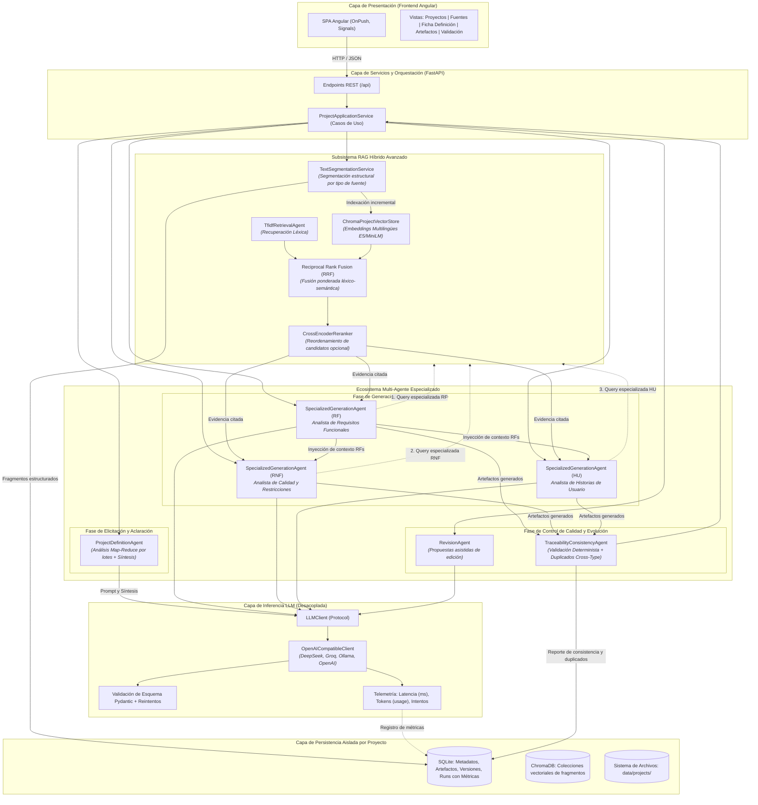
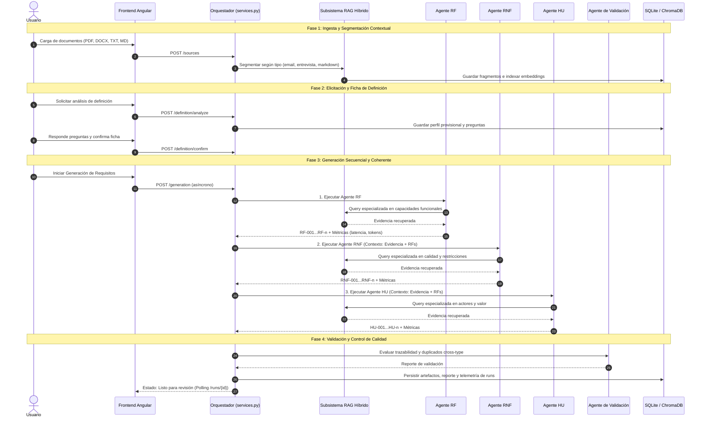

# Arquitectura Multi-Agente de ReqLab (Tesis)

Este documento describe formalmente la arquitectura multi-agente especializada con recuperación aumentada por generación (RAG Híbrido) implementada en **ReqLab**.

---

## 1. Diagrama General de la Arquitectura

---

## 2. Descripción de los Roles y Agentes

| Agente | Responsabilidad Principal | Estrategia / Técnica |
|---|---|---|
| **`ProjectDefinitionAgent`** | Elicitación y detección de incertidumbres iniciales. | **Map-Reduce:** Analiza los fragmentos en lotes de hasta 18.000 caracteres extrayendo hallazgos en 8 dimensiones clave (objetivo, actores, alcance, etc.) y sintetiza un perfil provisional con preguntas adaptativas. |
| **`SpecializedGenerationAgent (RF)`** | Identificar capacidades y comportamientos observables del sistema. | Recuperación RAG orientada a verbos y procesos operativos (`permitir`, `registrar`, `consultar`, `gestionar`). Generación estructurada con citas exactas a fragmentos. |
| **`SpecializedGenerationAgent (RNF)`** | Identificar atributos de calidad, rendimiento y restricciones medibles. | Recuperación RAG orientada a seguridad, latencia, disponibilidad y normativas. Recibe los **RF previos** como contexto para asociar calidad a capacidades reales. |
| **`SpecializedGenerationAgent (HU)`** | Modelar las necesidades y valor desde la perspectiva de los actores. | Recuperación RAG orientada a roles y beneficios. Recibe los **RF previos** para alinear las historias a las capacidades del sistema sin duplicar su redacción técnica. |
| **`TraceabilityConsistencyAgent`** | Auditoría y control de calidad determinista (sin consumo de LLM). | Verificación de citas válidas, sintaxis obligatoria de HU (*Como / Quiero / Para*), reglas heurísticas de taxonomía y **detección de duplicados internos y cross-type** mediante similitud Jaccard. |
| **`RevisionAgent`** | Proponer ediciones iterativas sobre artefactos existentes. | Recupera evidencia relevante según la instrucción del usuario y formula una propuesta sin sobreescribir la versión vigente en SQLite. |

---

## 3. Flujo Metodológico de Datos

