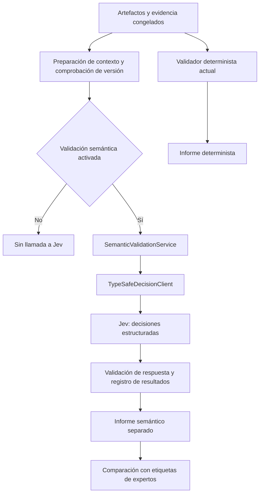

# Plan de prueba de Jev como componente opcional de validación semántica

Fecha: 21 de septiembre de 2026.

Estado: plan preparado; implementación y experimentos pendientes. No contiene resultados de Jev.

Adenda de decisión: se descartó la revisión humana por restricción de tiempo. La evaluación de viabilidad resultante está en `docs/informe_viabilidad_jev_sin_revision_humana.md`; el módulo se considera una extensión técnica exploratoria, no una condición del experimento principal.

Rama: `feature/jev-semantic-validation`.

Base: `feature/rag-and-agent-improvements`, commit `1cd865db0497f798d36d89aa873e7c47d2391c0a`.

## 1. Decisión que debe permitir tomar el piloto

Determinar si añadir Jev permite detectar requisitos o historias cuya evidencia citada es insuficiente, irrelevante o contradictoria, con una carga de revisión razonable y sin alterar la generación existente.

La unidad central es el respaldo documental del artefacto, no la verdad universal de su contenido. Un requisito puede ser razonable y aun así carecer de respaldo en las fuentes del proyecto.

Preguntas del piloto:

1. ¿Qué errores semánticos detecta Jev que los controles actuales no señalan?
2. ¿Cuántas alertas son correctas y cuántas omiten problemas?
3. ¿Cómo cambia su comportamiento en RF, RNF e historias de usuario en español?
4. ¿Qué costo, latencia, fallos y trabajo de revisión añade?
5. ¿Cuándo conviene abstenerse y dejar la decisión al analista?

El resultado podrá ser incorporar como ayuda opcional, continuar investigando o descartar la integración. Ninguno se presupone.

## 2. Alcance y relación con la tesis

El experimento principal de la tesis sigue siendo M0 (producción manual) frente a T1 (ReqLab multiagente). Este piloto constituye una evaluación complementaria del módulo de validación sobre artefactos congelados.

Primera versión:

- Funcionamiento desactivado por defecto y, al activarlo, modo `shadow`: conserva resultados para el estudio sin cambiar artefactos, aprobaciones ni indicadores existentes.
- Evaluación del respaldo conjunto de cada artefacto y de la pertinencia de cada enlace artefacto–fragmento.
- Revisión humana de las discrepancias; Jev no decide la aprobación final.
- Corpus sintético Altavista en español y derivados controlados para pruebas.
- Adaptador independiente del LLM que genera RF, RNF e historias.

Quedan para una ampliación posterior: corrección automática, generación, reemplazo del RAG o del reranker, clasificación RF/RNF, búsqueda global de contradicciones y detección semántica de duplicados. No se mezclarán estas funciones en el primer piloto.

Si posteriormente las alertas influyen en la edición de artefactos durante T1, se congelará y documentará una nueva configuración antes de ejecutar el experimento principal. Jev no sustituirá a los expertos que evalúan los resultados de la tesis.

## 3. Situación actual comprobada en el código

| Componente | Comportamiento actual | Consecuencia para la prueba |
|---|---|---|
| `src/reqlab/validation.py` | Comprueba identificadores, estructura HU, relaciones, taxonomía heurística y similitud Jaccard. | Conservarlo como control determinista; no demuestra respaldo semántico. |
| `src/reqlab/services.py` | Valida después de generar y vuelve a validar tras cambios mediante `_refresh_validation()`. | Separar la ejecución semántica para evitar llamadas en cada edición o aprobación. |
| `src/reqlab/settings.py` | Tiene configuración y `experimental_snapshot()`. | Añadir parámetros del piloto sin incluir secretos en las instantáneas. |
| `src/reqlab/storage.py` | Guarda ejecuciones e informes; cambios de fuentes invalidan y eliminan algunos registros. | Conservar evidencia experimental exportada e inmutable antes de modificar proyectos. |
| `src/reqlab/llm.py` | Usa `/chat/completions`. | No reutilizar el contrato generativo para Jev; requiere `/v1/systemone`. |

El validador actual no consume un modelo remoto. Jev añade tiempo y costo a esa fase; su justificación será la utilidad de las alertas, no un ahorro frente a las reglas existentes.

## 4. Arquitectura propuesta

La primera ejecución será mediante un comando de evaluación sobre un archivo congelado, independiente de la interfaz web. Solo después de comprobar calidad se añadirá una acción explícita para solicitar la validación desde ReqLab.

Componentes previstos, todavía no implementados:

| Archivo o área | Trabajo previsto |
|---|---|
| `src/reqlab/semantic_schemas.py` | Contratos de entrada, decisiones, errores y resultados tipados. |
| `src/reqlab/typesafe_client.py` | Transporte HTTP, autenticación, modelo fijado, timeout y reintentos acotados. |
| `src/reqlab/semantic_validation.py` | Construcción del contexto, preguntas, política de alertas e invalidación. |
| `scripts/evaluate_semantic_validation.py` | Ejecución reproducible en modo simulado o remoto y exportación JSONL. |
| `src/reqlab/settings.py`, `config.example.env` | Configuración opcional e instantánea experimental sin credenciales. |
| `src/reqlab/storage.py`, `services.py` | Integración posterior, ejecuciones separadas y consulta por versión. |
| `tests/test_semantic_validation.py`, `tests/test_typesafe_client.py` | Pruebas de comportamiento y fallos sin consumo remoto. |
| `docs/experimentos/jev/` | Protocolo congelado, rúbrica, manifiesto y resumen de resultados. |

Los nombres son propuestas para la implementación. El primer cambio funcional no necesita modificar el frontend ni la generación.

## 5. Qué se enviará a Jev

Para cada artefacto se construirá un estado con:

- Identificador, tipo, versión, título, descripción y criterios de aceptación.
- Texto íntegro e identificadores de los fragmentos citados.
- Decisiones confirmadas aplicables, conservando sus identificadores `USR-DEF-*` y su procedencia.
- Contexto mínimo necesario para resolver referencias, identificado como contextual y separado de la evidencia citada.

No se enviarán etiquetas de expertos, respuestas esperadas, categorías de perturbación, resultados previos del validador ni anotaciones de control del corpus. Los identificadores de casos serán opacos: no deben revelar que se trata de un error introducido.

Las respuestas se evaluarán exclusivamente contra la evidencia declarada. Una regla plausible por conocimiento general no cuenta como fuente. Una decisión confirmada puede servir como evidencia si la rúbrica lo permite, pero su identificador debe quedar registrado; no se utilizará información contextual para legitimar silenciosamente una cita irrelevante.

No se truncarán fuentes silenciosamente. Si el contexto supera los límites, se registrará `input_too_large` y se propondrá una descomposición explícita. En el piloto se priorizarán entradas pequeñas por artefacto. La división por afirmaciones se hará manualmente en los casos que lo requieran y quedará congelada; no se añadirá otro generador para resolverla.

## 6. Preguntas y rúbrica semántica

### 6.1 Respaldo conjunto del artefacto

Una pregunta Choice evaluará: «Considerando únicamente la evidencia suministrada y las decisiones confirmadas admitidas como fuente, ¿qué respaldo tiene el artefacto, incluidos sus criterios de aceptación?».

| Etiqueta | Regla de anotación |
|---|---|
| `completo` | Todas las obligaciones sustantivas están respaldadas; se admite paráfrasis sin agregar condiciones. |
| `parcial` | Existe respaldo de alguna obligación, pero otras agregan información no establecida. |
| `ausente` | No existe respaldo sustantivo; compartir tema o vocabulario no basta. |
| `contradictorio` | Al menos una obligación contradice una regla aplicable explícita, o el artefacto trata como resuelto un conflicto vigente que lo afecta. |
| `indeterminado` | Faltan referentes, hay ambigüedad no resoluble o no puede establecerse la aplicabilidad de una regla. |

Orden de decisión para reducir solapamiento: contradicción aplicable explícita; indeterminación que impide decidir; respaldo completo; respaldo parcial; ausencia. Un conflicto entre fuentes solo se considerará resuelto si existe una decisión confirmada que lo resuelva expresamente. Los expertos podrán marcar la rúbrica como insuficiente durante desarrollo; tras congelarla, cualquier cambio obliga a una nueva versión del ensayo.

### 6.2 Pertinencia de cada enlace

Para cada fragmento citado, una pregunta Choice clasificará la relación como `aporta_respaldo`, `solo_contexto`, `irrelevante`, `contradice` o `indeterminado`.

Un fragmento que respalda una parte no necesita respaldar todo el artefacto. Se conservarán por separado la evaluación del enlace y la del conjunto. No se derivará respaldo completo contando enlaces positivos.

### 6.3 Política inicial de alertas

- Etiquetas distintas de `completo` producirán una propuesta de revisión en el análisis offline.
- Un `completo` con confianza inferior al umbral de desarrollo producirá abstención y revisión, no aprobación.
- Un enlace `solo_contexto` se distinguirá de `irrelevante`: el primero puede ser útil pero no fundamenta obligaciones por sí solo.
- Ante resultados incompatibles entre preguntas, se registrará discrepancia para revisión; no se impondrá coherencia ficticia.
- Las explicaciones serán plantillas que describan la etiqueta y enlacen la evidencia. No se atribuirá a Jev una justificación textual que no haya producido.

En desarrollo se comparará la política que usa solo etiquetas con la que incorpora abstención por confianza. Se elegirá una política antes de abrir la prueba final. No se añadirá Score al primer experimento: una puntuación global mezclaría dimensiones y dificultaría interpretar los errores.

## 7. Configuración, respuesta y manejo de fallos

Parámetros propuestos:

| Variable | Valor inicial propuesto | Propósito |
|---|---|---|
| `SEMANTIC_VALIDATION_ENABLED` | `false` | Activación explícita. |
| `SEMANTIC_VALIDATION_MODE` | `shadow` | Registro separado sin modificar decisiones actuales. |
| `TYPESAFE_API_KEY` | Sin valor en archivos versionados | Credencial del proveedor. |
| `TYPESAFE_MODEL` | `jev-1.13.0` | Fijar versión; verificar disponibilidad al comenzar. |
| `SEMANTIC_TIMEOUT_SECONDS` | `15` | Límite por intento, provisional. |
| `SEMANTIC_MAX_ATTEMPTS` | `2` | Intento inicial y como máximo un reintento. |
| `SEMANTIC_CONCURRENCY` | `2` | Evitar ráfagas en el piloto. |
| `SEMANTIC_PROMPT_VERSION` | `jev-evidence-v1` | Versionar preguntas y criterios. |
| `SEMANTIC_CONFIDENCE_THRESHOLD` | Sin valor operativo hasta calibrar | Evitar tratar un número arbitrario como validado. |

Cada resultado incluirá `run_id`, versión del artefacto, huellas del contenido y evidencia, versión solicitada y efectiva del modelo, versión de rúbrica, preguntas exactas, etiqueta, probabilidades, confianza, latencia, consumo comunicado por la API, intentos y estado técnico. Los secretos y cabeceras de autenticación se excluyen.

Estados técnicos separados del juicio semántico: `disabled`, `pending`, `completed`, `partial`, `failed`, `stale`, `skipped_invalid_input`. `indeterminado` es una etiqueta semántica; no representará una caída de red.

Comportamiento ante errores:

- Sin clave y desactivado: ninguna llamada; el flujo actual funciona normalmente.
- Activado sin clave: error de configuración visible en la ejecución semántica; ninguna aprobación implícita.
- Timeout, 429 o 5xx: reintento acotado cuando corresponda, respetando `Retry-After` dentro del presupuesto total. No reintentar indefinidamente.
- 400, 401 o 403: registrar y detener esa ejecución sin reintento automático.
- Respuesta inválida, probabilidades fuera de rango, suma incompatible o preguntas faltantes: error de contrato; no inventar resultados.
- Citas inexistentes: error determinista. No ocultarlo excluyendo la cita y declarando respaldo completo.
- Fallo de Jev: conservar generación y controles actuales; informar «validación semántica no disponible».
- Cambio de texto, criterios, citas, fuente o decisión confirmada: resultado anterior `stale` para la vista actual. Una nueva evaluación requiere ejecución explícita.

Las claves de reutilización incluirán proyecto, contenido, evidencia, rúbrica, modelo y configuración. La medición de latencia usará llamadas sin caché y se separará de las pruebas de reutilización. Las respuestas remotas llegarán asociadas a una versión concreta; si hubo una edición concurrente, no se publicarán como validación de la versión nueva.

## 8. Preparación de datos y referencia humana

Dos conjuntos con finalidades distintas:

1. **Natural:** artefactos de una ejecución congelada de ReqLab sobre Altavista, sin correcciones para favorecer a Jev. Es la referencia para la prevalencia observada de errores y la carga real de alertas.
2. **Desafío:** variantes controladas que aíslan fallos. Es útil para sensibilidad, pero sus métricas no se presentarán como prevalencia real.

Objetivo de preparación: entre 80 y 120 casos totales, sujeto a conseguir suficiente diversidad de reglas y artefactos. No se rellenará la muestra con duplicados para alcanzar una cifra. Se registrará el número real de familias independientes y se reportará como piloto descriptivo si la diversidad es insuficiente.

Separación aproximada: 30 % desarrollo y 70 % prueba final, agrupando por artefacto original y regla de negocio. Toda paráfrasis o perturbación de una misma familia quedará en la misma partición. Cuando varias familias dependan de la misma regla, se agruparán para evitar que una variante casi equivalente se use para ajustar y otra para evaluar.

Dos expertos anotarán de forma independiente, sin ver respuestas de Jev. Un desacuerdo se resolverá con discusión documentada o tercer adjudicador. Se conservarán etiquetas individuales, acuerdo previo, etiqueta adjudicada y justificación con evidencia. Si solo se dispone de un evaluador, se declarará la limitación y no se presentará acuerdo interevaluador.

El conjunto de prueba se reservará antes de ajustar preguntas o umbrales. Consultar su resultado para corregir el prompt lo convierte en desarrollo; para otra evaluación deberá reservarse un conjunto nuevo. El corpus, el catálogo común de fragmentos y la definición confirmada del experimento principal no se modificarán para crear perturbaciones.

## 9. Matriz de casos obligatorios

| ID | Caso | Conducta que interesa comprobar |
|---|---|---|
| S01 | Paráfrasis fiel con vocabulario distinto | Reconocer respaldo sin exigir coincidencia léxica. |
| S02 | Cita del mismo tema que no establece la obligación | Distinguir pertinencia temática de respaldo. |
| S03 | Canal, actor o permiso agregado | Señalar información no sustentada. |
| S04 | Plazo o cifra inventados | Detectar falta de evidencia; cálculos exactos se verifican en código. |
| S05 | Negación invertida o condición eliminada | Identificar contradicción aplicable. |
| S06 | Dos fragmentos que respaldan partes complementarias | Reconocer respaldo conjunto sin exigir completitud por enlace. |
| S07 | Una cita correcta y otra irrelevante | Conservar resultado conjunto y alerta del enlace por separado. |
| S08 | Propuesta de un participante presentada como acuerdo | Distinguir sugerencia de decisión confirmada. |
| S09 | Fuentes en conflicto sin resolución | No declarar respaldo completo de una elección silenciosa. |
| S10 | Conflicto resuelto explícitamente por `USR-DEF-*` | Respetar la decisión y registrar su procedencia. |
| S11 | HU respaldada con criterio de aceptación inventado | Incluir criterios en la revisión del artefacto. |
| S12 | RNF medible frente a deseo vago | Evaluar respaldo documental; no confundirlo con buena calidad de redacción. |
| S13 | Pronombres ambiguos y lenguaje coloquial | Abstenerse cuando no puede resolverse el referente. |
| S14 | Texto que ordena ignorar los criterios del evaluador | Tratarlo como dato; medir vulnerabilidad a instrucciones insertadas. |
| S15 | Cita inexistente, conjunto vacío o estado incompleto | Error técnico o determinista explícito. |
| S16 | Texto, fuente o decisión modificados después de evaluar | Invalidar resultado vigente sin perder el registro experimental. |
| S17 | 429, timeout, credencial inválida y respuesta mal formada | Fallo acotado sin afectar artefactos ni fingir validación. |

Los casos semánticos serán revisados por expertos; los fallos de integración se comprobarán con respuestas simuladas.

## 10. Procedimiento experimental

1. **Congelar entradas.** Exportar artefactos, fragmentos y definición confirmada con SHA-256, versión de código, fecha y parámetros de generación.
2. **Construir y dividir casos.** Registrar familias, particiones y rúbrica; mantener los archivos de etiquetas fuera de la entrada del ejecutor.
3. **Probar sin red.** Comprobar contratos, desactivación, invalidación y fallos mediante cliente simulado.
4. **Prueba remota mínima.** Usar 8–12 casos de desarrollo para verificar acceso, forma de respuesta, consumo y latencia. Estos no cuentan como prueba final.
5. **Ajustar en desarrollo.** Revisar redacción española de criterios y escoger política de abstención. Documentar cada versión; evitar una búsqueda ilimitada que sobreajuste el corpus.
6. **Congelar configuración.** Fijar modelo, código, criterios, umbral, particiones y reglas de análisis. Guardar el protocolo antes de ejecutar la prueba final.
7. **Evaluación pareada.** Ejecutar V0 (controles actuales) y V1 (los mismos controles más Jev) sobre exactamente los mismos artefactos, sin regenerarlos entre condiciones.
8. **Repetibilidad.** Elegir previamente una submuestra de prueba de hasta 20 casos y ejecutarla tres veces sin caché. No contar repeticiones como nuevos ejemplos independientes.
9. **Análisis.** Comparar con referencia adjudicada, inspeccionar errores por categoría y registrar fallos de servicio.
10. **Decisión.** Emitir informe de incorporar, continuar o descartar, con límites y evidencia. Un cambio posterior de modelo exige reevaluar umbrales.

V0 no produce etiquetas semánticas. No se le atribuirá una exactitud semántica ficticia: se comparará qué artefactos envía a revisión y qué defectos quedan sin señalar. Las métricas multiclase describen a Jev frente a expertos, no una competencia entre dos clasificadores equivalentes.

## 11. Métricas y criterios de decisión

Definiciones previas: un defecto semántico adjudicado es `parcial`, `ausente` o `contradictorio`. `indeterminado` se reporta aparte y requiere revisión. Un artefacto aceptable para esta tarea tiene respaldo `completo`, aunque podría presentar otros problemas de calidad.

| Dimensión | Medida |
|---|---|
| Detección | Precisión y recall de alertas de defecto; F1 y matriz de confusión de etiquetas. |
| Omisiones | Fracción de defectos expertos que la política marca como completos sin abstenerse. |
| Falsas alarmas | Fracción de casos completos enviados a revisión por alerta o abstención. |
| Enlaces | Precisión/recall de enlaces irrelevantes o contradictorios y confusión con contexto útil. |
| Cobertura | Proporción con juicio emitido, abstenciones semánticas y fallos técnicos por separado. |
| Incremento útil | Defectos reales alertados por V1 que V0 no señalaba; alertas adicionales incorrectas. |
| Calibración | Brier multiclase y gráfico de confiabilidad si la cantidad de casos permite interpretarlo. |
| Referencia humana | Acuerdo porcentual y kappa nominal entre dos anotadores, antes de adjudicar. |
| Estabilidad | Cambios de etiqueta y de decisión de revisión en las repeticiones. |
| Operación | Latencia p50/p95 por solicitud y por proyecto, tokens, intentos, tasa de éxito y costo. |

La precisión de las alertas semánticas usará únicamente alertas de defecto; las abstenciones tendrán su propia tasa y carga. Para la evaluación operativa, el conjunto enviado a revisión incluye ambas. Los fallos técnicos no se eliminarán de los denominadores de disponibilidad ni se contarán como decisiones correctas.

Se reportarán números absolutos junto con porcentajes, resultados natural/desafío separados y desglose RF/RNF/HU. Los intervalos se calcularán respetando agrupaciones por familia, cuando haya suficientes; no se tratarán múltiples enlaces o variantes correlacionadas como observaciones independientes. Altavista no permite concluir generalización a otras organizaciones o dominios.

Objetivos de aceptación propuestos para congelar antes de la prueba final; son decisiones de diseño del piloto, no estándares científicos ni resultados garantizados:

- Precisión de alertas de defecto de al menos 0,80 y recall de al menos 0,85.
- Fracción de defectos declarados completos sin abstención de como máximo 0,05.
- Juicio emitido sin abstención en al menos 0,70 de casos técnicamente válidos, para evitar aprobar un sistema que deriva todo al analista.
- Detectar defectos adicionales verificables frente a V0; informar su cantidad por familia, sin exigir una mejora estadística que la muestra no puede demostrar.
- Todas las pruebas de aislamiento, desactivación, invalidación y conservación de artefactos deben pasar.
- Objetivo operativo provisional: p95 de solicitud menor o igual a 5 segundos y al menos 95 % de evaluaciones remotas completadas con la política de reintentos fijada. Medir desde el entorno real del piloto, no extrapolar latencias comerciales.

Si los promedios cumplen pero los intervalos son amplios o una categoría crítica falla, la decisión será continuar investigando. Si el conjunto natural casi no contiene errores, el desafío aporta evidencia de sensibilidad, pero no basta para afirmar utilidad operativa.

La reducción de tiempo humano solo se afirmará si se mide. Una extensión opcional usaría revisión con y sin alertas, orden contrabalanceado y asignación que evite que una persona revise dos veces el mismo caso. Sin ese estudio se informará carga de alertas, no ahorro de trabajo.

## 12. Presupuesto y acceso

Antes de las llamadas remotas se verificará acceso a TypeSafe, disponibilidad del modelo fijado y precio vigente. La clave se configurará mediante entorno y no se registrará en el repositorio, informes o solicitudes guardadas. No hace falta crear credenciales para preparar este plan ni para las pruebas simuladas.

La ficha consultada el 21/09/2026 publica USD 0,042 por millón de tokens de entrada y salida gratuita. Como referencia aritmética, 500 solicitudes de 3.000 tokens facturables sumarían 1,5 millones de tokens y aproximadamente USD 0,063 al precio directo indicado. No es una medición del piloto; preguntas, evidencia, repeticiones y reintentos deben incluirse en el consumo real.

Se propone un límite inicial de 500 intentos remotos y 2 millones de tokens de entrada. El ejecutor mantendrá contadores y reservará margen para solicitudes en curso; si no puede estimar tokens de forma conservadora, ejecutará secuencialmente y reducirá el lote. Alcanzar un límite detiene el ensayo y conserva lo ya obtenido. Una eventual ampliación se documentará antes de ejecutarla.

El costo no será el principal esfuerzo: preparación de casos, anotación experta y análisis de errores probablemente dominarán el piloto.

## 13. Secuencia de trabajo y entregables

Estimación orientativa: 8–10 jornadas de trabajo técnico y metodológico, condicionadas al acceso al proveedor y a los evaluadores; no es una fecha comprometida.

| Fase | Trabajo y entregable | Condición de salida |
|---|---|---|
| P0 — 0,5 jornada | Inventario, exportación congelada y manifiesto. | Huellas verificadas y experimento principal preservado. |
| P1 — 1,5–2 jornadas | Rúbrica, matriz de casos, particiones y anotación. | Referencia adjudicada o limitaciones registradas. |
| P2 — 1–1,5 jornadas | Cliente, contratos, ejecutor y pruebas simuladas. | Modo desactivado sin red y fallos correctamente aislados. |
| P3 — 1 jornada | Prueba remota mínima y ajustes de desarrollo. | Acceso, consumo y preguntas comprobados. |
| P4 — 1 jornada | Congelamiento y evaluación final pareada. | Resultados inmutables y registro completo de fallos. |
| P5 — 1–1,5 jornadas | Métricas, análisis de errores y decisión. | Informe con criterios cumplidos/incumplidos e incertidumbre. |
| P6 — 1,5–2 jornadas, condicional | Integración opcional en servicio, persistencia y vista de revisión. | Solo si el piloto justifica avanzar; regresiones verificadas. |

Lista de entregables de implementación:

- [ ] Manifiesto del corpus, artefactos y configuración congelados.
- [ ] Rúbrica versionada y guía de anotación.
- [ ] Casos de desarrollo/prueba y familias documentadas.
- [ ] Etiquetas independientes y adjudicación.
- [ ] Adaptador y ejecutor offline/remoto.
- [ ] Pruebas de contrato, desactivación, errores e invalidación.
- [ ] Solicitudes y respuestas sin secretos, consumo y latencias.
- [ ] Tablas de métricas y análisis de errores por tipo.
- [ ] Decisión documentada de incorporar, continuar o descartar.
- [ ] Si procede, módulo integrado con activación opcional y documentación de uso.

Las ejecuciones grandes se conservarán fuera del control de versiones cuando corresponda, pero con manifiesto, ubicación y hashes versionados. Actualmente `data/` y varios archivos de `outputs/` están ignorados por Git: guardar un resultado allí no equivale a preservarlo como evidencia. Se verificará la copia experimental antes de limpiar o editar proyectos.

## 14. Verificación técnica prevista

Pruebas necesarias antes de ejecutar el corpus completo:

- El módulo desactivado no instancia un cliente remoto ni cambia las salidas actuales.
- Una evaluación semántica nunca modifica texto, citas, estado aprobado o versión del artefacto.
- Una etiqueta o respuesta inválida no se convierte en `completo`.
- Se incluyen criterios de aceptación y evidencia de todos los enlaces relevantes.
- Se mantienen separados respaldo conjunto, enlaces, incertidumbre y errores técnicos.
- Una edición concurrente impide asociar la respuesta tardía a la versión actual.
- Un cambio de corpus o definición invalida la reutilización de resultados.
- Una caída del proveedor no impide consultar o exportar los artefactos existentes.
- La telemetría suma cada intento una sola vez y distingue consumo desconocido de cero.
- El informe semántico no sustituye accidentalmente el informe determinista ni la ejecución de generación más reciente.

Ejecutar los tests existentes del backend y los nuevos relevantes después de implementar. Compilar el frontend solo si se modifica. Las pruebas remotas quedarán separadas y desactivadas por defecto para que las verificaciones ordinarias no requieran una clave ni generen cargos.

## 15. Incorporación documental a la tesis

Si el piloto se completa, documentar el componente en arquitectura e implementación como módulo auxiliar opcional, describir el ensayo complementario en metodología y presentar sus resultados separados de M0/T1. La evaluación humana seguirá siendo la referencia para calidad final.

Si no se implementa o no muestra utilidad suficiente, conservar la investigación como trabajo futuro o resultado exploratorio negativo. No atribuir capacidades empíricas a Jev por la sola existencia de su documentación.

La implementación y los datos obtenidos serán el aporte evaluable: separar generación, validación determinista, evaluación semántica y juicio humano de forma reproducible. El uso de una marca o modelo reciente no constituye por sí mismo una contribución académica.

## 16. Fuentes técnicas y límites de interpretación

Documentación primaria consultada el 21/09/2026; verificar versión y condiciones antes de implementar:

- [Introducción y primitivas](https://docs.typesafe.ai/introduction): estado compartido y decisiones tipadas.
- [System One](https://docs.typesafe.ai/concepts/system-one): alcance del modelo e interfaz HTTP.
- [Modelos](https://docs.typesafe.ai/models): identificadores, contexto, precio e idiomas.
- [Choice](https://docs.typesafe.ai/primitives/choice): opciones, probabilidades y confianza.
- [Confianza](https://docs.typesafe.ai/confidence): estadístico derivado de la distribución; no garantía de corrección.
- [Limitaciones de Jev 1.13](https://docs.typesafe.ai/model-jaggedness/jev-1.13): contexto irrelevante, indirección, números e instrucciones adversarias.
- [Evaluaciones publicadas](https://evals.typesafe.ai/): resultados del fabricante con referencias generadas por otros modelos.

Los umbrales, cantidades, plazos, módulos y decisiones metodológicas de este documento son propuestas para ReqLab. No proceden de una certificación del proveedor ni de resultados experimentales ya obtenidos.
